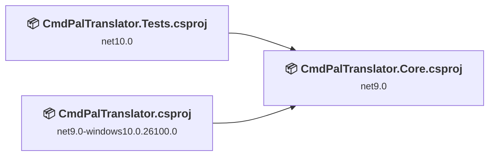
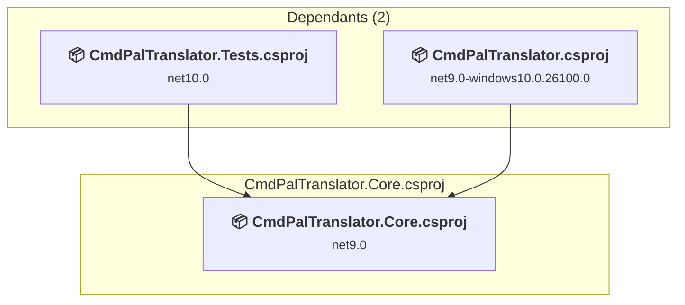
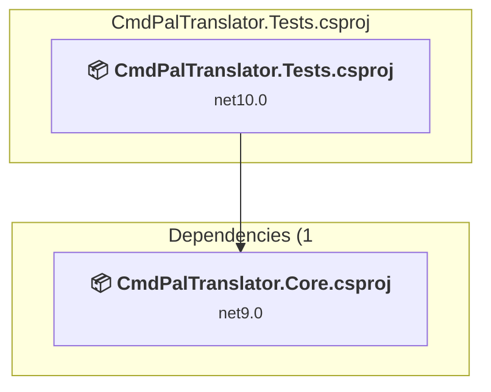
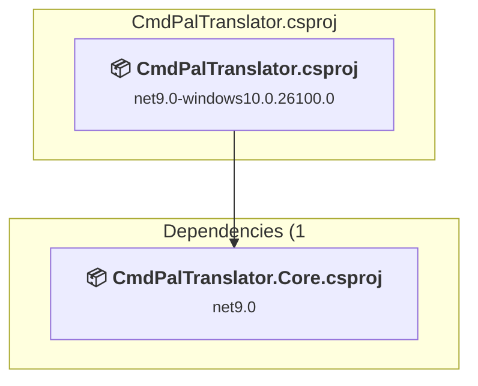

# Projects and dependencies analysis

This document provides a comprehensive overview of the projects and their dependencies in the context of upgrading to .NETCoreApp,Version=v10.0.

## Table of Contents

- [Executive Summary](#executive-Summary)
  - [Highlevel Metrics](#highlevel-metrics)
  - [Projects Compatibility](#projects-compatibility)
  - [Package Compatibility](#package-compatibility)
  - [API Compatibility](#api-compatibility)
  - [Binding Redirect Configuration](#binding-redirect-configuration)
- [Aggregate NuGet packages details](#aggregate-nuget-packages-details)
- [Top API Migration Challenges](#top-api-migration-challenges)
  - [Technologies and Features](#technologies-and-features)
  - [Most Frequent API Issues](#most-frequent-api-issues)
- [Projects Relationship Graph](#projects-relationship-graph)
- [Project Details](#project-details)

  - [CmdPalTranslator.Core\CmdPalTranslator.Core.csproj](#cmdpaltranslatorcorecmdpaltranslatorcorecsproj)
  - [CmdPalTranslator.Tests\CmdPalTranslator.Tests.csproj](#cmdpaltranslatortestscmdpaltranslatortestscsproj)
  - [CmdPalTranslator\CmdPalTranslator.csproj](#cmdpaltranslatorcmdpaltranslatorcsproj)

## Executive Summary

### Highlevel Metrics

| Metric | Count | Status |
| :--- | :---: | :--- |
| Total Projects | 3 | 2 require upgrade |
| Total NuGet Packages | 9 | 2 need upgrade |
| Total Code Files | 25 |  |
| Total Code Files with Incidents | 8 |  |
| Total Lines of Code | 1920 |  |
| Total Number of Issues | 30 |  |
| Estimated LOC to modify | 26+ | at least 1.4% of codebase |

### Projects Compatibility

| Project | Target Framework | Difficulty | Package Issues | API Issues | Binding Issues | Est. LOC Impact | Description |
| :--- | :---: | :---: | :---: | :---: | :---: | :---: | :--- |
| [CmdPalTranslator.Core\CmdPalTranslator.Core.csproj](#cmdpaltranslatorcorecmdpaltranslatorcorecsproj) | net9.0 | 🟢 Low | 0 | 24 | 0 | 24+ | ClassLibrary, Sdk Style = True |
| [CmdPalTranslator.Tests\CmdPalTranslator.Tests.csproj](#cmdpaltranslatortestscmdpaltranslatortestscsproj) | net10.0 | ✅ None | 0 | 0 | 0 |  | DotNetCoreApp, Sdk Style = True |
| [CmdPalTranslator\CmdPalTranslator.csproj](#cmdpaltranslatorcmdpaltranslatorcsproj) | net9.0-windows10.0.26100.0 | 🟢 Low | 2 | 2 | 0 | 2+ | WinForms, Sdk Style = True |

### Package Compatibility

| Status | Count | Percentage |
| :--- | :---: | :---: |
| ✅ Compatible | 7 | 77.8% |
| ⚠️ Incompatible | 2 | 22.2% |
| 🔄 Upgrade Recommended | 0 | 0.0% |
| ***Total NuGet Packages*** | ***9*** | ***100%*** |

### API Compatibility

| Category | Count | Impact |
| :--- | :---: | :--- |
| 🔴 Binary Incompatible | 0 | High - Require code changes |
| 🟡 Source Incompatible | 2 | Medium - Needs re-compilation and potential conflicting API error fixing |
| 🔵 Behavioral change | 24 | Low - Behavioral changes that may require testing at runtime |
| ✅ Compatible | 2110 |  |
| ***Total APIs Analyzed*** | ***2136*** |  |

## Aggregate NuGet packages details

| Package | Current Version | Suggested Version | Projects | Description |
| :--- | :---: | :---: | :--- | :--- |
| Microsoft.CommandPalette.Extensions | 0.9.260303001 |  | [CmdPalTranslator.csproj](#cmdpaltranslatorcmdpaltranslatorcsproj) | ⚠️NuGet 套件不相容 |
| Microsoft.Extensions.Http.Polly | 10.0.8 |  | [CmdPalTranslator.Core.csproj](#cmdpaltranslatorcorecmdpaltranslatorcorecsproj) | ✅Compatible |
| Microsoft.Testing.Extensions.CodeCoverage | 18.5.2 |  | [CmdPalTranslator.Tests.csproj](#cmdpaltranslatortestscmdpaltranslatortestscsproj) | ✅Compatible |
| Microsoft.Testing.Extensions.TrxReport | 2.2.3 |  | [CmdPalTranslator.Tests.csproj](#cmdpaltranslatortestscmdpaltranslatortestscsproj) | ✅Compatible |
| Microsoft.Windows.CsWinRT | 2.2.0 |  | [CmdPalTranslator.csproj](#cmdpaltranslatorcmdpaltranslatorcsproj) | ✅Compatible |
| Microsoft.Windows.SDK.BuildTools.MSIX | 1.7.260518100 |  | [CmdPalTranslator.csproj](#cmdpaltranslatorcmdpaltranslatorcsproj) | ✅Compatible |
| MSTest.TestAdapter | 4.2.3 |  | [CmdPalTranslator.Tests.csproj](#cmdpaltranslatortestscmdpaltranslatortestscsproj) | ✅Compatible |
| MSTest.TestFramework | 4.2.3 |  | [CmdPalTranslator.Tests.csproj](#cmdpaltranslatortestscmdpaltranslatortestscsproj) | ✅Compatible |
| Shmuelie.WinRTServer | 2.2.1 | 1.3.1 | [CmdPalTranslator.csproj](#cmdpaltranslatorcmdpaltranslatorcsproj) | ⚠️NuGet 套件不相容 |

## Top API Migration Challenges

### Technologies and Features

| Technology | Issues | Percentage | Migration Path |
| :--- | :---: | :---: | :--- |

### Most Frequent API Issues

| API | Count | Percentage | Category |
| :--- | :---: | :---: | :--- |
| T:System.Uri | 18 | 69.2% | Behavioral Change |
| T:System.Net.Http.HttpContent | 4 | 15.4% | Behavioral Change |
| M:System.Uri.#ctor(System.String) | 2 | 7.7% | Behavioral Change |
| M:System.TimeSpan.FromSeconds(System.Int64) | 1 | 3.8% | Source Incompatible |
| M:System.TimeSpan.FromSeconds(System.Double) | 1 | 3.8% | Source Incompatible |

## Projects Relationship Graph

Legend:
📦 SDK-style project
⚙️ Classic project

## Project Details

### CmdPalTranslator.Core\CmdPalTranslator.Core.csproj

#### Project Info

- **Current Target Framework:** net9.0
- **Proposed Target Framework:** net10.0
- **SDK-style**: True
- **Project Kind:** ClassLibrary
- **Dependencies**: 0
- **Dependants**: 2
- **Number of Files**: 9
- **Number of Files with Incidents**: 6
- **Lines of Code**: 743
- **Estimated LOC to modify**: 24+ (at least 3.2% of the project)

#### Dependency Graph

Legend:
📦 SDK-style project
⚙️ Classic project

### API Compatibility

| Category | Count | Impact |
| :--- | :---: | :--- |
| 🔴 Binary Incompatible | 0 | High - Require code changes |
| 🟡 Source Incompatible | 2 | Medium - Needs re-compilation and potential conflicting API error fixing |
| 🔵 Behavioral change | 22 | Low - Behavioral changes that may require testing at runtime |
| ✅ Compatible | 1074 |  |
| ***Total APIs Analyzed*** | ***1098*** |  |

### CmdPalTranslator.Tests\CmdPalTranslator.Tests.csproj

#### Project Info

- **Current Target Framework:** net10.0✅
- **SDK-style**: True
- **Project Kind:** DotNetCoreApp
- **Dependencies**: 1
- **Dependants**: 0
- **Number of Files**: 5
- **Lines of Code**: 519
- **Estimated LOC to modify**: 0+ (at least 0.0% of the project)

#### Dependency Graph

Legend:
📦 SDK-style project
⚙️ Classic project

### API Compatibility

| Category | Count | Impact |
| :--- | :---: | :--- |
| 🔴 Binary Incompatible | 0 | High - Require code changes |
| 🟡 Source Incompatible | 0 | Medium - Needs re-compilation and potential conflicting API error fixing |
| 🔵 Behavioral change | 0 | Low - Behavioral changes that may require testing at runtime |
| ✅ Compatible | 0 |  |
| ***Total APIs Analyzed*** | ***0*** |  |

### CmdPalTranslator\CmdPalTranslator.csproj

#### Project Info

- **Current Target Framework:** net9.0-windows10.0.26100.0
- **Proposed Target Framework:** net10.0-windows
- **SDK-style**: True
- **Project Kind:** WinForms
- **Dependencies**: 1
- **Dependants**: 0
- **Number of Files**: 70
- **Number of Files with Incidents**: 2
- **Lines of Code**: 658
- **Estimated LOC to modify**: 2+ (at least 0.3% of the project)

#### Dependency Graph

Legend:
📦 SDK-style project
⚙️ Classic project

### API Compatibility

| Category | Count | Impact |
| :--- | :---: | :--- |
| 🔴 Binary Incompatible | 0 | High - Require code changes |
| 🟡 Source Incompatible | 0 | Medium - Needs re-compilation and potential conflicting API error fixing |
| 🔵 Behavioral change | 2 | Low - Behavioral changes that may require testing at runtime |
| ✅ Compatible | 1036 |  |
| ***Total APIs Analyzed*** | ***1038*** |  |

