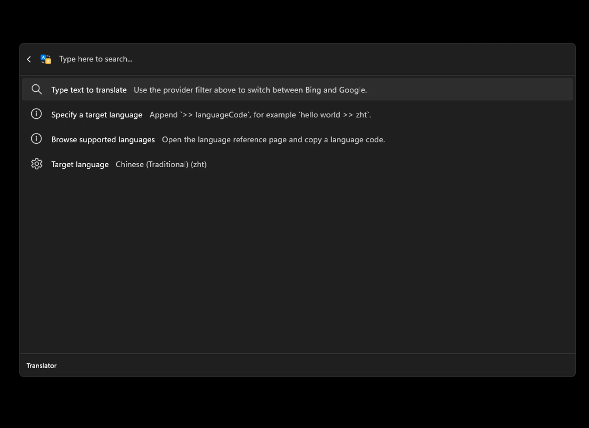
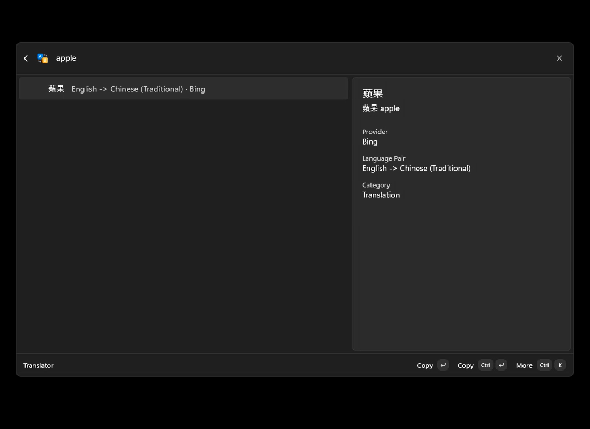
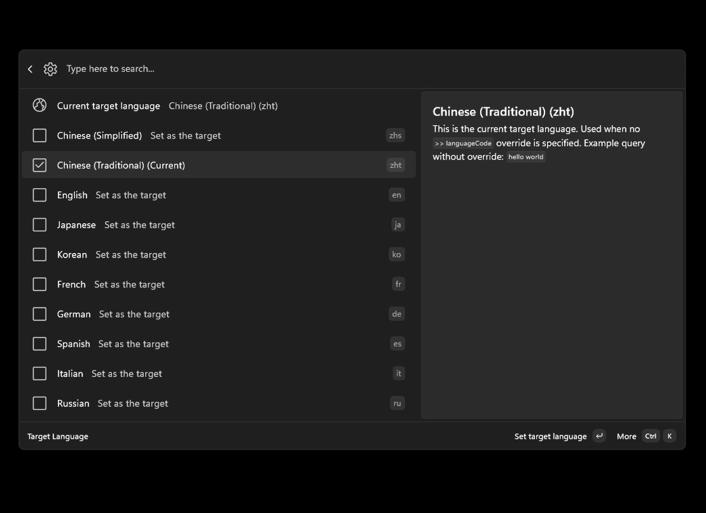
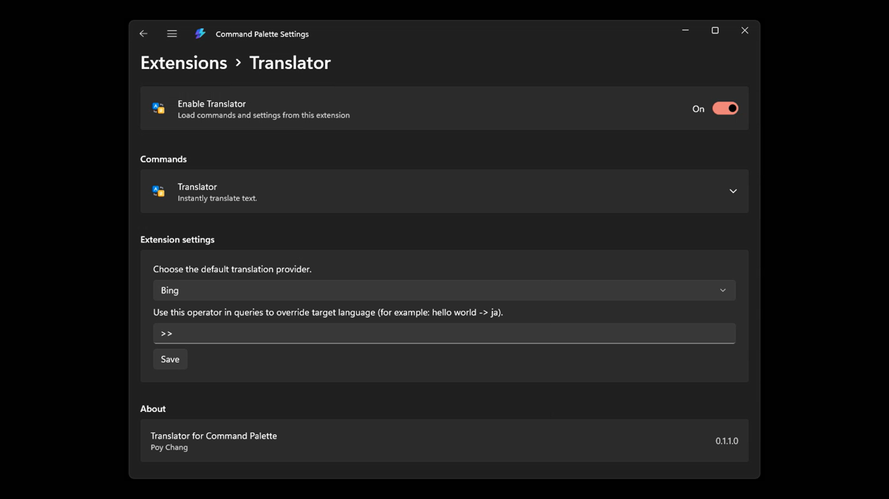

# Translator for Command Palette

語言：[English](README.md) | 繁體中文

<a href="https://apps.microsoft.com/store/detail/9NSHZ9B3KJFW" target="_blank" rel="noopener noreferrer"></a>

`Translator for Command Palette` 是 Windows Command Palette 的翻譯擴充功能。它把翻譯、語言選擇、結果複製與開啟原始翻譯網站整合在同一個 Command Palette 工作流程裡。

目前版本為 `0.1.1.0`。專案已升級至 `.NET 10`，主程式以 MSIX 封裝為 Command Palette extension，支援 `win-x64` 與 `win-arm64` 發佈。

## 畫面預覽









## 主要功能

- 整合 Windows Command Palette，提供 `Translator` 頂層命令。
- 內建 `Bing` 與 `Google` 兩個翻譯 provider，預設使用 `Bing`。
- 可在 extension settings 的 `Preferred provider` 選擇預設翻譯來源。
- 支援自動偵測來源語言，預設目標語言為繁體中文 `zht`。
- 可在 `Target language` 頁面搜尋、選取並儲存預設目標語言。
- 支援 `text >> languageCode` 查詢語法，直接覆寫單次翻譯的目標語言。
- 可在 extension settings 的 `Translate operator` 自訂查詢運算子，例如改成 `=>`。
- 翻譯結果可直接複製，也可從更多操作複製原文或開啟 Bing / Google 翻譯網頁。
- Google provider 會在回應包含字典資料時一併顯示 Dictionary 項目。
- 內建 `Supported Languages` 頁面，可瀏覽語言代碼並複製範例查詢。
- 翻譯輸入採用短延遲更新，避免每次按鍵都立即送出請求。

## 使用方式

安裝後開啟 Windows Command Palette，搜尋並執行 `Translator`。

直接輸入文字即可翻譯：

```text
hello world
```

未指定目標語言時，會使用設定中的 `Target language`。初始預設值為繁體中文 `zht`。

若要單次指定目標語言，使用預設運算子 `>>`：

```text
hello world >> ja
open source software >> fr
今天天氣很好 >> en
```

如果你在 settings 中把 `Translate operator` 改成 `=>`，查詢也會跟著改成：

```text
hello world => ja
```

空白或無效的自訂運算子會退回預設值 `>>`。

## 設定

Command Palette extension settings 目前提供兩個設定：

- `Preferred provider`：選擇預設翻譯 provider，可選 `Bing` 或 `Google`。
- `Translate operator`：設定查詢中用來覆寫目標語言的運算子，預設為 `>>`。

翻譯頁面中的 `Target language` 會開啟語言設定頁，選取後立即儲存。設定會寫入本機：

```text
%LOCALAPPDATA%\CmdPalTranslator\settings.json
```

設定檔會保存：

- `targetLanguageId`
- `preferredProviderId`
- `translateOperator`

如果設定檔不存在、內容無效、目標語言未知，或把目標語言設為 `auto`，專案會回到內建預設值。

## 支援語言

目前內建語言代碼如下：

| Code | Language |
| --- | --- |
| `auto` | Auto Detect |
| `zhs` | Chinese (Simplified) |
| `zht` | Chinese (Traditional) |
| `en` | English |
| `ja` | Japanese |
| `ko` | Korean |
| `fr` | French |
| `de` | German |
| `es` | Spanish |
| `it` | Italian |
| `ru` | Russian |
| `ar` | Arabic |
| `he` | Hebrew |
| `pt` | Portuguese |
| `th` | Thai |

`LanguageCatalog` 會把內部語言代碼對應到 Bing 與 Google 各自需要的 provider code。例如繁體中文在 Google 使用 `zh-TW`，在 Bing 使用 `zh-Hant`。

## 專案結構

```text
.
├─ README.md
├─ privacy.md
└─ src
   ├─ CmdPalTranslator.slnx
   ├─ CmdPalTranslator
   │  ├─ Pages
   │  ├─ Commands
   │  ├─ Assets
   │  └─ Package.appxmanifest
   ├─ CmdPalTranslator.Core
   │  ├─ Models
   │  ├─ Providers
   │  └─ Services
   └─ CmdPalTranslator.Tests
```

- `src/CmdPalTranslator/`：Command Palette extension 主程式、命令、頁面、MSIX manifest 與素材。
- `src/CmdPalTranslator.Core/`：翻譯 provider、查詢解析、語言目錄、設定讀寫等核心邏輯。
- `src/CmdPalTranslator.Tests/`：MSTest 測試專案，包含 unit 與 live integration 測試。

## 開發

### 環境需求

- Windows 11
- Visual Studio 2022，含 .NET / Windows app 開發相關工作負載
- .NET 10 SDK
- Windows SDK / MSIX 建置工具
- 可連網環境，因為 provider 會呼叫公開 Web endpoint

套件版本集中管理於 `src/Directory.Packages.props`。測試 runner 使用 Microsoft Testing Platform。

### 還原與建置

在 repo 根目錄執行：

```bash
dotnet restore src/CmdPalTranslator.slnx
dotnet build src/CmdPalTranslator.slnx -p:Platform=x64
```

若只想建置主程式：

```bash
dotnet build src/CmdPalTranslator/CmdPalTranslator.csproj -p:Platform=x64
```

`ARM64` 也受支援：

```bash
dotnet build src/CmdPalTranslator.slnx -p:Platform=ARM64
```

### 執行測試

執行 unit tests：

```bash
dotnet test src/CmdPalTranslator.Tests/CmdPalTranslator.Tests.csproj --filter TestCategory=Unit
```

執行 live integration tests：

```bash
dotnet test src/CmdPalTranslator.Tests/CmdPalTranslator.Tests.csproj --filter TestCategory=Integration
```

Integration tests 會實際呼叫 Bing 與 Google 的線上翻譯 endpoint，適合在確認網路與 provider 行為時執行。

### 建置 MSIX

建立 x64 Release MSIX：

```bash
dotnet build src/CmdPalTranslator/CmdPalTranslator.csproj -c Release -p:Platform=x64 -p:GenerateAppxPackageOnBuild=true -p:AppxPackageDir=AppPackages\x64\
```

建立 ARM64 Release MSIX：

```bash
dotnet build src/CmdPalTranslator/CmdPalTranslator.csproj -c Release -p:Platform=ARM64 -p:GenerateAppxPackageOnBuild=true -p:AppxPackageDir=AppPackages\ARM64\
```

建置前會自動把 scale-specific 圖示複製成 Store / MSIX 驗證需要的基礎檔名。

### 發佈

可透過 [Microsoft Partner Center](https://partner.microsoft.com/dashboard/home) 發佈至 Microsoft Store，或提交到 WinGet。Command Palette extension 的封裝與發佈流程可參考官方文件：

[Publish a Command Palette extension](https://learn.microsoft.com/en-us/windows/powertoys/command-palette/publish-extension)

## 備註

- Bing 與 Google provider 目前透過公開 Web endpoint 取得翻譯結果，endpoint 行為未來可能變動。
- Bing provider 會先取得並快取翻譯頁面的驗證資訊，驗證失效時會重試一次。
- HTTP client 內建 gzip/deflate 解壓縮、30 秒 timeout 與暫時性錯誤重試。
- Release build 啟用 trimming，並針對 JSON serialization 使用 source generation 以支援 NativeAOT/trim 友善建置。
- 若要增加新的翻譯來源，可實作 `ITranslatorProvider`，再在 `TranslatorService` 註冊 provider。
